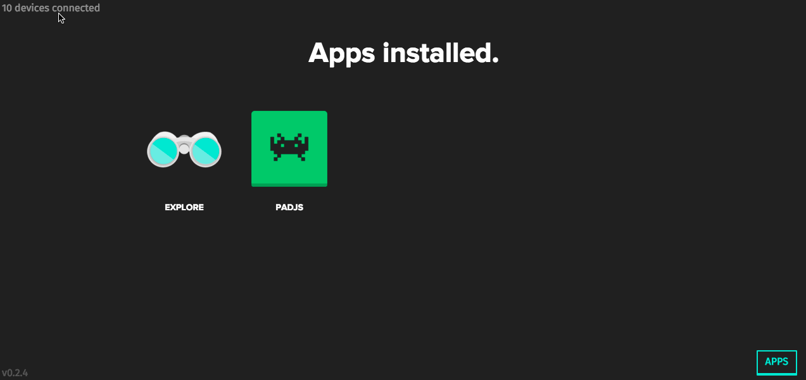
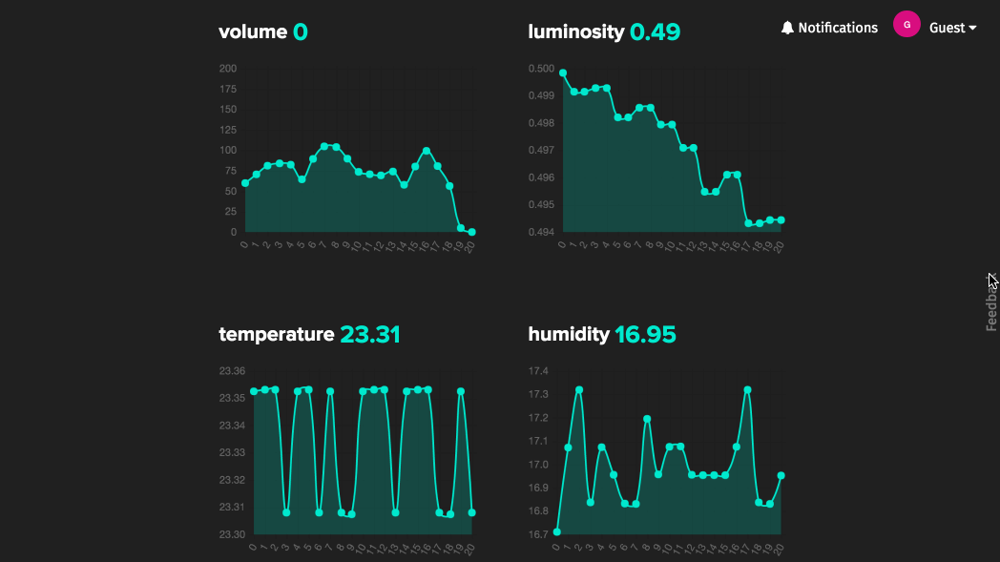

 # Netbeast Dashboard 

[](https://travis-ci.org/netbeast/dashboard)
[](https://ci.appveyor.com/project/jsdario/dashboard)
[](http://bit.ly/1VYfqDH)
[](http://npm.anvaka.com/#/view/2d/netbeast-cli)

### Important notice

Netbeast Dashboard project is moving on.

Developing is hard. Being disruptive is harder. Industry won't stop trying to impose new protocols and standards. Indies won't stop creating open source projects that everyone should adopt --this repo was our own bet-- but it is really hard to take off and critical adoption rate is really difficult to achieve. So we changed our focus.

Firstly we developed [Yeti Smart Home](https://getyeti.co/). It is a mobile app with effortless installation and a thoroughtly worked UI that is the perfect platform to build the next generation tools for IoT development that is actually usable by non-technical people.
We also did it in an open way, sharing our know-how with the community and releasing a number of packages. You can read it more here: [Developing Beyond the Screen](https://medium.com/react-native-development/developing-beyond-the-screen-9af812b96724).

Now we are going to take a second step. We just started The Bigfoot Project. We took everything we learnt from building the first Netbeast Dashboard, and the UX / UI experience of Yeti, developing a third beast. Instead of developing a new platform or protocol we are releasing a series of documentation, guides and wrapper of already standard tools to make them work with each other. So the Bigfoot project is a collection of already existing tools that work together out of the box and will help you develop your next connected thing as soon as possible. [Please join us here](https://github.com/netbeast/bigfoot).

We want to make compatible all the pieces of our ecosystem to serve best users and developers equally, as our mission is to make things work for people, instead making people work for things.

> Netbeast team

### Connect everything. Regardless its brand or technology.

One API, unlimited products and hacks. Netbeast middleware translates messages from different IoT protocols and device interfaces so they work as one. Have no more "hubs". Work across **devices** not _brands_.

```
var netbeast = require('netbeast')
netbeast.find().then(function () {
  netbeast('lights').set({ power: 1 }) // will turn on all lights in your home
})
```

# Contents
* [Installation](#installation)
  * [Basic](#installation-basic)
  * [Raspberry / Beagle Bone / Pine64 or your choice of board](#installation-board)
  * [Using docker](#installation-docker)
* [Overview](#overview)
* [Documentation](#documentation)
* [Create IoT with Node.js](#iot-with-node)
  * [Apps](#apps)
  * [Connect devices](#connect-devices)
* [Community](#community)
* [Contribute](#contribute)
* [LICENSE.md](https://github.com/netbeast/dashboard/blob/master/LICENSE.txt)

<a name="installation"></a>
# Installation
<a name="installation-basic"></a>
## Basic
Make sure you have installed [git](https://git-scm.com/book/en/v2/Getting-Started-Installing-Git) and [nodejs](https://nodejs.org/en/).
```bash
npm install -g netbeast-cli
netbeast start
```

Find it live at http://localhost:8000 or run it as `netbeast start --port <PORT>`

**Pro tip.** To get started developing you will find handy to have it installed in a folder of
your choice.
```
git clone https://github.com/netbeast/dashboard
cd dashboard
npm install --production
npm start
```



<a name="installation-board"></a>
## Raspberry / Beagle Bone / Pine64 or your choice of board
Make sure again you have installed [git](https://git-scm.com/book/en/v2/Getting-Started-Installing-Git) and [nodejs](https://nodejs.org/en/). It can be tricky depending on your OS & architecture. If any doubts please reach [forum](http://bit.ly/23UyVMR) or open an [issue](https://github.com/netbeast/dashboard/issues).
1. Apply the basic installation from above, preferably using git.
```
git clone https://github.com/netbeast/dashboard . # clone in this folder
npm i --production # no front-end or test dependencies
```
1. Keep it running 24h 7 days a week, to use it as Smart Home Hub. You can use utilities such as [forever](https://www.npmjs.com/package/forever) or [pm2](https://www.npmjs.com/package/pm2).
```
npm i -g pm2
sudo pm2 start index.js --port 80
```
3. [Soon] Learn how to attach a DHCP name to your Netbeast as https://home.netbeast and how to deal with wireless configuration in Linux from our [blog](https://blog.netbeast.co).

<a name="installation-docker"></a>
## Using docker :whale:
Make sure you already have [docker](https://docs.docker.com/engine/installation/) installed.

1. Run our docker image, if it's the first time, it'll be downloaded from the [Docker Hub](https://hub.docker.com/r/netbeast/netbeast/)

```
docker run -p 49160:8000 -d netbeast/netbeast
```

This will run Netbeast dashboard on port 49160 of the host running the container. You can now play with it. 

Access the dashboard on [http://localhost:49160](http://localhost:49160)

Et voilà!


<a name="overview"></a>
# Overview
#### Find inspiration, think about new projects, connect your new hardware.
Netbeast apps are HTML5 user interfaces that enable controlling IoT or visualizing their data. Netbeast plugins are apps that translate from the Netbeast IoT Unified Scheme, to each particular implementation of an IoT device.

**Explore existing apps and plugins of our [public registry](https://dashboard.netbeast.co/explore).**

## Control devices regardless of their brand and technology
Take a look on our unified API on action in this demo on youtube, under a Netbeast app that creates new scenes.

[](https://www.youtube.com/watch?v=YNERwJdykuQ)

https://www.youtube.com/watch?v=YNERwJdykuQ

## Measure all your data
Use the [Netbeast API](https://github.com/netbeast/api) along with the dashboard to publish data through MQTT or reuse it in your apps. [Read more](http://docs.netbeast.co/chapters/api_reference/index.html
).



## Write IoT apps without spending on hardware or suffering expensive deployments
Take advance of Netbeast IoT middleware to test your apps with software that mocks the hardware interface.


Find tutorials in the [docs](http://bit.ly/1VYfqDH), read a blog post about it on [TopTal](https://www.toptal.com/nodejs/programming-visually-with-node-red) or join the [forum](http://bit.ly/23UyVMR) to ask how to do it.

<a name="documentation"></a>
## Documentation
We publish a [gitbook](https://www.gitbook.com/book/netbeast/docs/details) with fresh documentation on [https://docs.netbeast.co](http://bit.ly/1VYfqDH). If you want to open an issue, contribute or edit it, find your way on its github repo https://github.com/netbeast/docs.

<a name="iot-with-node"></a>
# Create IoT with Node.js
In Netbeast we care about education, openness and interoperability. We have created a series of workshops to teach developers to better use HTTP, MQTT in combination with the **Dashboard** to create data bindings and incredible apps. Use your favorite boards and platforms as Arduino, Pi Zero, Pine64, Belkin Wemo, Homekit and a infinite list, connected.

<a name="apps"></a>
## Apps
A Netbeast app allows you to run the Dashboard unique API in the browser or backend equally. Just expose some user interface in your apps root. In the following snippet we serve in the root all files inside `public` folder.

```
var express = require('express')
var app = express()

// Netbeast apps need to accept the port to be launched by parameters
var argv = require('minimist')(process.argv.slice(2))

app.use(express.static('public'))

var server = app.listen(argv.port || 31416, function () {
  var host = server.address().address
  var port = server.address().port
  console.log('Example app listening at http://%s:%s', host, port)
})
```

Learn how to create new scenes and user interfaces as bots, speech recognition, smart triggers. Learn how to develop Netbeast apps, debug and publish them on the [documentation](https://docs.netbeast.co/chapters/developing/apps/write_your_first_app.html)

<a name="connect-devices"></a>
## Connect Devices
> A plugin is an app that enables your Dashboard to communicate with a different protocol or proprietary device.
> It's like if you, that want to learn Chinese, could speak Chinese by installing an app.
> Luis, cofounder of Netbeast

A basic plugin must implement at least a `discovery` primitive to declare itself on Netbeast's database.
Fill the gaps to create your first hardware integration into Netbeast:
```
var netbeast = require('netbeast')
var express = require('express')
var cmd = require('commander') // reads --port from command line

// Netbeast tells you in which port to run your Plugin endpoint
cmd.option('-p, --port <n>', 'Port to start the HTTP server', parseInt)
.parse(process.argv)

var app = express()

/*
* Discover your resources / scan the network
* And declare your routes into the API
*/

app.get('/discover', function () {
	/* TODO, implement discovery */

	/* for each device */
	netbeast('topic').create({ app: 'my-first-plugin', hook: 'DEVICE_ID' })
	/* end of for */

	/* or */
	/* Register all device together and delete the resources no longer available */
	netbeast('topic').udateDB({ app: 'my-first-plugin', hook: ['DEVICE1_ID', 'DEVICE2_ID', 'DEVICE3_ID', 'DEVICE4_ID'] })
})

/*
* Create here your API routes
* app.get(...), app.post(...), app.put(...), app.delete(...)
*/

app.get('/:device_id', function (req, res) {
	// id of the device the dashboard wants
	// << req.params.device_id >>
	// dashboard will do GET on this route when
	// netbeast('topic').get({})

	/* TODO: Return device values from req.query */

	// res.json({ YOUR_PLUGIN_DATA })
})

app.post('/:device_id', function (req, res) {
	// id of the device the dashboard wants
	// << req.params.device_id >>
	// dashboard will do POST on this route when
	// netbeast('topic').set({})

	/* TODO: Change device values from req.body */

	// res.json({ YOUR_PLUGIN_DATA })
})


var server = app.listen(cmd.port || 4000, function () {
  console.log('Netbeast plugin started on %s:%s',
  server.address().address,
  server.address().port)
})
```

Learn how to launch it, debug it and publish it on the [documentation](https://docs.netbeast.co/chapters/developing/plugins/write_your_first_plugin.html).

<a name="community"></a>
## Community
#####  Join us in our [forum](http://forum.netbeast.co/c/otros/desarrolladores)
#####  Ask for an invitation to join our Slack team [here](https://netbeastco.typeform.com/to/VGLexg)
##### Project [website](https://netbeast.co/developer)
<a name="contribute"></a>
## Contribute
Take a look to our [CONTRIBUTING.md](https://github.com/netbeast/dashboard/blob/master/CONTRIBUTING.md) file in order to see how can you be part of this project. Or take a look on [Netbeast's discourse forum](http://bit.ly/23UyVMR) to find for inspiration, projects and help.

**TL;DR** Make a Pull Request.
If your PR is eventually merged don't forget to write down your name on the [AUTHORS.txt](https://github.com/netbeast/dashboard/blob/master/AUTHORS) file.

---

&nbsp;&nbsp;&nbsp;

